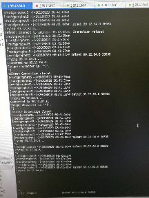
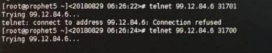
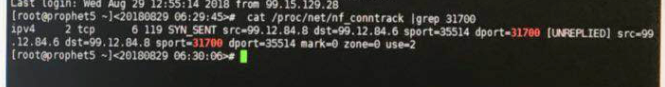
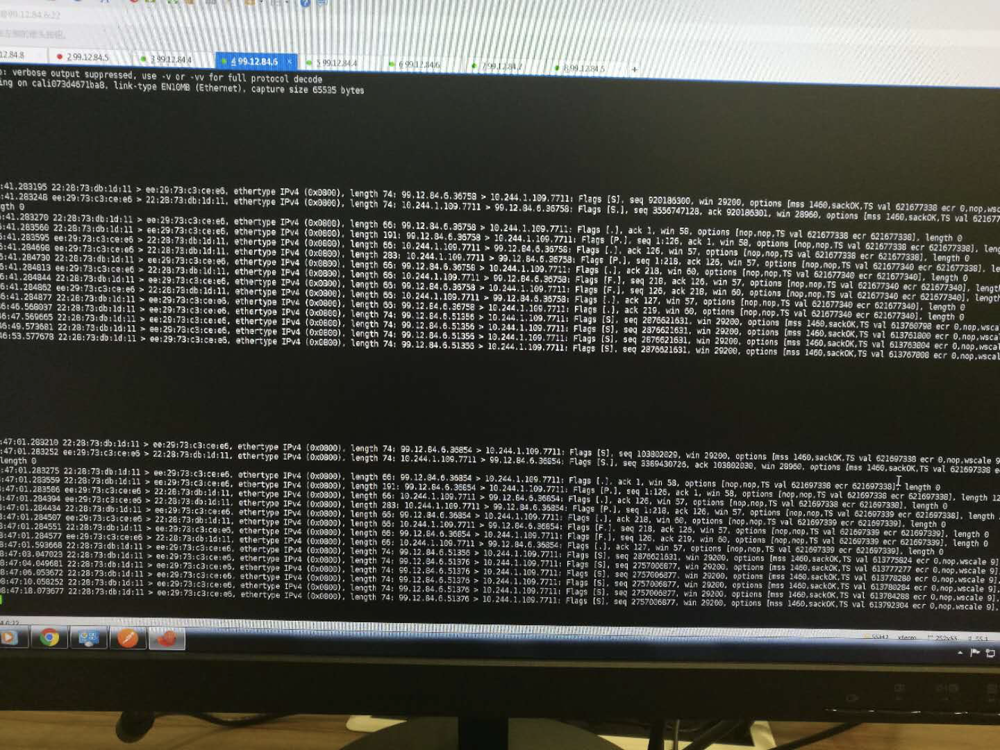

# 排错指南 - 网络

本文档介绍排查网络异常的步骤和方法。

网络异常的范围：

1. 节点间 Pod IP 不通；
1. 节点间 Server 服务不通；
1. NodePort 不通；
1. 以及由此导致的 域名解析失败；

## mysql service 和 pod 均不通，在两个节点的 flannel.1 接口抓包，结果显示调用方收到了回包

原因：

1. mysql server 所在节点 ARP 缓存的调用方节点 flannel.1 接口 MAC 地址不对，导致调用方虽然收到了回包(三层发送)，但是发现接口MAC 地址不对，便丢弃了。
1. 初步怀疑与删除了 flanneld daemonset，但是没有清理 flanneld 网络接口，后续重新创建 daemonset 时，flanneld 缓存了旧的 MAC 地址有关；

解决方案：删除错误的 ARP 缓存记录

# 访问 Pod 服务，第一次通，后续时通时不通

现象：

1. 节点（prophet1）上的 Pod 对外通过 NodePort 提供服务，但从其它节点和本节点 telnet NodeIP:NodePort ，第一次通，后续都不通（卡住）：

    

1. 从其它节点(prophet5) telnet 异常节点 prophet1 未监听的端口，被正常 refused，但 telnet NodePort 时卡住：

    

1. nf_conntrack 连接追踪结论显示：prophet5 没有收到异常节点发送的 SYN_ACK 响应：

    

1. prophet1 上的各 K8S 组件、iptables 规则都正常、ip_forward 功能也开启；
1. 查找 NodePort 对应的 Pod IP，使用 ip route get Pod_IP 命令查找对应 Pod 容器的 calico 接口名称，然后在该接口上抓包。
1. 抓包结果显示：

+ 第一次请求 TCP Timestamp value 是 621677338，被正确响应；
+ 后续几次请求的 TCP Timestamp value 是 6137607xx，没有响应；
+ 紧接着请求的 TCP Timestamp value 是 621697338，被正确响应；
+ 后续的几次请求的 TCP Timestamp value 是 6137607xx，没有响应；

    

原因：

1. 一个 NAT 和 net.ipv4.tcp_tw_recycle 引起的血案！
1. K8S 节点使用 NAT 机制支持访问 Pod IP、Service IP、NodePort；
1. 节点开启了内核参数 net.ipv4.tcp_tw_recycle，开启了该参数后，无法保证经过 NAT 转换后的客户端 TCP 请求 Header 中的 Timestamp 值严格递增；（因为各客户端时间可能不同步，很难保证他们的 TCP 请求的 timestamp 严格递增）
1. 而 kernel 的 PASW 机制要求所有来自同一个 Host IP 的 TCP 包 timestamp 必须是递增的，当收到的 timestamp 变小时，会认为这是一个过期的数据包，将其丢弃；

解决方案：

1. 使用命令 sysctl -w net.ipv4.tcp_tw_recycle=0 关闭 K8S 节点的 tcp_tw_recycle。

# Pod 服务收到的请求来源 IP 非 Pod IP，而是所在节点 flannel.1 的 IP

现象：

1. keystone 收到的请求来源 IP 大量为.0 结尾的各节点 flannnel.1 IP 地址，而非实际发起请求的 Pod IP；
1. 只有和 keystone 在一个节点的 Pod 请求， 才会正确显示来源 IP；

原因：

1. flannel 启动后生成的 docker 环境变量中包含 --ip-masq=true 参数：

    ``` bash
    [root@m7-devops-128071 ~]# cat /var/run/flannel/docker
    DOCKER_OPT_BIP="--bip=172.30.24.1/24"
    DOCKER_OPT_IPMASQ="--ip-masq=true"
    DOCKER_OPT_MTU="--mtu=1450"
    DOCKER_NETWORK_OPTIONS=" --bip=172.30.24.1/24 --ip-masq=true --mtu=1450"
    ```

1. dockerd 启动后读取该环境变量，设置如下 POSTROUTING 规则：

    ``` bash
    [root@m7-devops-128071 ~]# iptables-save |grep POSTROUTING|grep -v '^:'
    -A POSTROUTING -m comment --comment "kubernetes postrouting rules" -j KUBE-POSTROUTING
    -A POSTROUTING -s 172.30.24.0/24 ! -o docker0 -j MASQUERADE
    -A POSTROUTING -s 172.30.24.4/32 -d 172.30.24.4/32 -p tcp -m tcp --dport 3306 -j MASQUERADE
    -A KUBE-POSTROUTING -m comment --comment "kubernetes service traffic requiring SNAT" -m mark --mark 0x4000/0x4000 -j MASQUERADE
    ```

其中第二条规则：`-A POSTROUTING -s 172.30.24.0/24 ! -o docker0 -j MASQUERADE`，将来自本节点 POD 访问其他节点 POD 的请求做了 SNAT，即来源 IP 设置为节点的 flannel.1 地址；访问本节点 POD 的请求，因不匹配 ! -o docker0 规则，所以不会做 SNAT，来源 IP 为 POD IP；

解决办法：

1. 不能直接关闭 dockerd 的 `--ip-masq=true` 参数，否则 docker 容器无法访问除 Cluster 和 POD 外的 IP，如其他节点 IP、公网 IP 等；
1. 如果关闭 dockerd 的 `--ip-masq=true` 参数(通过修改 mk-docker-opts.sh 参数)，则必须手动添加如下 SNAT 规则 （注意将 172.30.24.0/24 替换为节点对应的 POD 网段 CIDR）：

    ``` bash
    -A POSTROUTING -s 172.30.24.0/24 ! -o docker0 -j my-chain1
    -A POSTROUTING -s 172.30.24.0/24 ! -o flannel.1 -j my-chain2
    -A my-chain1  ! -o flannel.1 -j MASQUERADE
    -A my-chain2  ! -o docker0 -j MASQUERADE
    ```